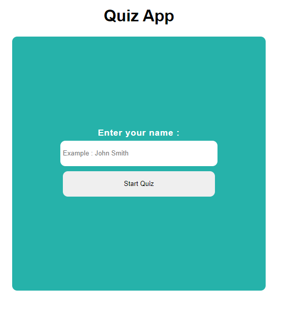
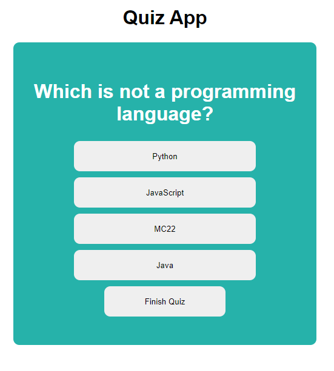
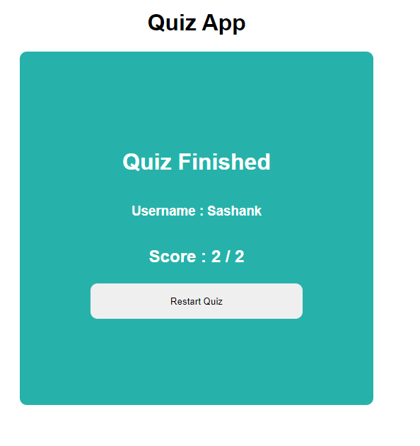

# React Quiz App

## In this project I learnt about
- useState hook.
- Context API and how we can maintain a global state with the help of Context.Provider
- Rendering questions and options from a externally exported array of objects.
- Tracking score of the user.
- Making sure to end the game once all questions are completed.
- Resetting the game state , to restart the game.

### Some screenshots of this applications

   
